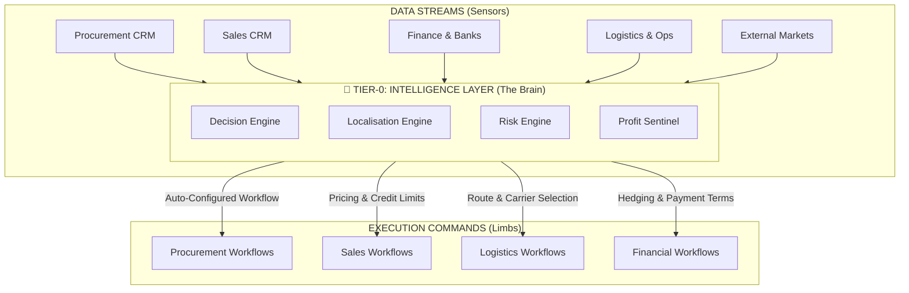
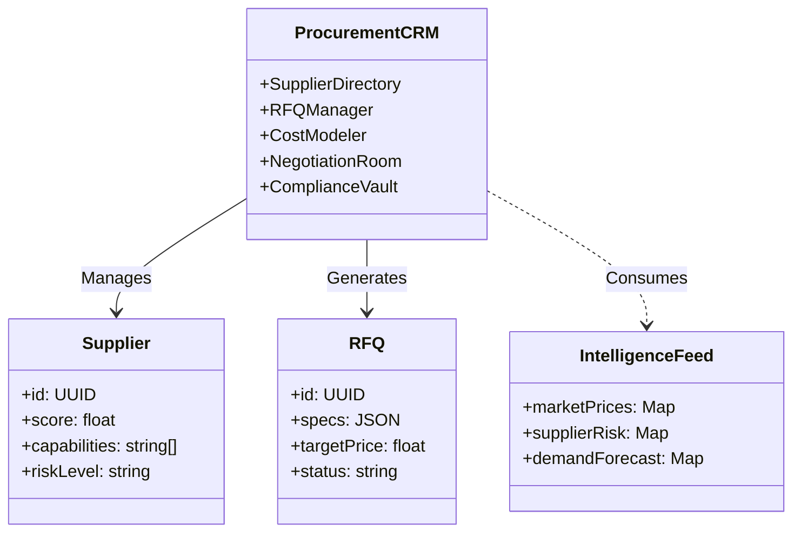
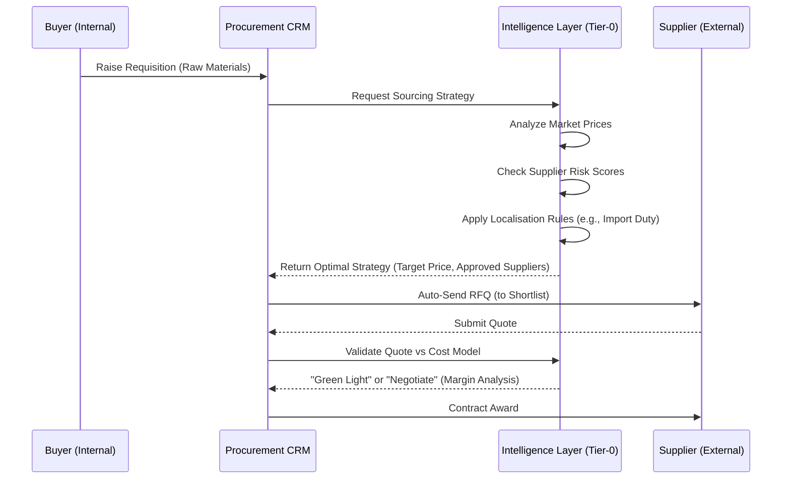

# MASTER SYSTEM ARCHITECTURE – HARVICS OS (TIER-0 INTELLIGENCE)

## 1. The Core Philosophy: Intelligence Upstream, Execution Downstream

In HARVICS OS, **Tier-0 (Intelligence)** is not a passive dashboard. It is the **Active Brain**.
All other tiers (Commercial, Operations, Finance) are **Limbs** that execute the Brain's decisions.



---

## 2. Procurement CRM Architecture

The **Procurement CRM** is a dedicated module feeding the Intelligence Layer. It is NOT just a database of suppliers; it is a **Strategic Sourcing Engine**.



### Procurement Workflow: From Need to Contract



---

## 3. End-to-End Workflow: The "Auto-Configured" Reality

How the **Localisation Engine** dictates the flow for a Global Trade deal (e.g., Importing Electronics to UAE).

```mermaid
flowchart TB
    START((New Deal Initiated)) --> LOC[Localisation Engine Scan]
    
    subgraph "AUTO-CONFIGURATION PHASE"
        LOC --> |"Detect Jurisdiction: UAE"| RULES[Load UAE Rules]
        RULES --> |"Compliance"| R1[Require ESMA Certification]
        RULES --> |"Finance"| R2[Currency: AED/USD, VAT: 5%]
        RULES --> |"Logistics"| R3[Port: Jebel Ali]
    end

    R1 & R2 & R3 --> CONFIG[Generate Deal Workflow]

    subgraph "EXECUTION PHASE"
        CONFIG --> STEP1[Supplier Uploads Certs]
        STEP1 --> STEP2[Finance Locks FX Rate]
        STEP2 --> STEP3[Logistics Books Container]
        STEP3 --> STEP4[Customs Clearance (Pre-filled)]
    end

    STEP4 --> FINISH((Delivery & Payment))
```
